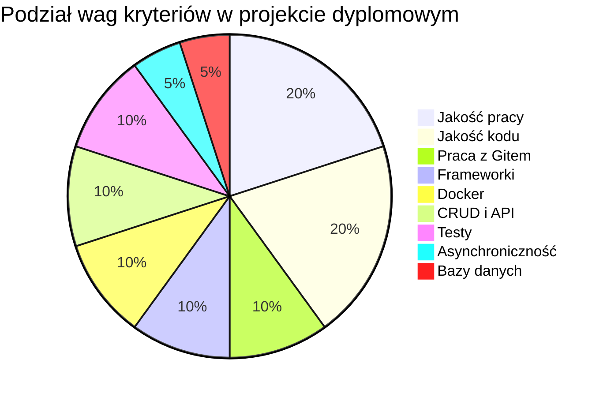
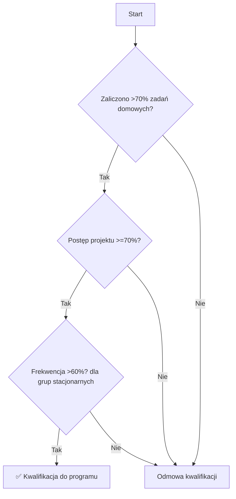

# System oceny postępów studentów kursu Python

## I. Zadania domowe

Ocena zadań domowych odbywa się według następującego systemu:

> [!TIP] Legenda ocen
> 
> - 🟩 **Zaliczone:** Zadanie oddane w całości bez błędów / z nieznacznymi błędami / wymagające drobnych poprawek.
>     
> - 🟦 **Zaliczone, ale...:** Zadanie oddane w terminie, ale zawiera krytyczne błędy, które wymagają poważnych poprawek. Wykładowca przekazuje szczegółową informację zwrotną.
>     
> - 🟥 **Niezaliczone:** Zadanie nie zostało oddane w wyznaczonym terminie lub oddano coś, co nie było częścią zadania.
>     

> [!NOTE] Ważne
> 
> ❗ W szkole nie stosuje się standardowego systemu ocen (np. w skali 1-5, 1-10 itd.).
> 
> <u>Standardowy system ocen w szkole nie jest stosowany.</u>

### Warunki kwalifikacji do programu zatrudnienia

Aby zakwalifikować się do programu zatrudnienia szkoły, student musi zaliczyć ponad **70% zadań domowych**.

> [!SUCCESS] Cel: Python Developer
> 
> - **Łącznie zadań na kursie:** 41 (100%)
>     
> - **Należy zaliczyć minimum:** 29 (70%)
>     

> [!WARNING] Przestrzeganie terminów
> 
> Wszystkie zadania domowe muszą być oddane w wyznaczonych terminach.
> 
> W przypadku, gdy wszystkie (lub większość) zadania domowe zostaną oddane pod koniec kursu, nie będą one liczone do programu zatrudnienia.

## II. Projekt dyplomowy

Do oceny projektu dyplomowego używa się pojęcia **“postęp wykonania pracy”**, który wyrażany jest w procentach.

### Kryteria oceny projektu

1. **Dobra jakość pracy** — **20%**
    
    - `+` Zgodność z wymaganiami, brak błędów, złożoność logiki.
        
    - `*` Dla unikalnych projektów waga może zostać zwiększona do **30%**.
        
2. **Jakość kodu** — **20%**
    
    - `+` Nazewnictwo, struktura, komentarze, OOP, adnotacje.
        
    - `*` Przy użyciu frameworków (np. Django) waga jest obniżana do **10%**.
        
3. **Pełnoprawna praca z Gitem** — **10%**
    
    - `+` <u>Kluczowy wymóg:</u> dobra historia commitów i jakościowo przygotowany plik **README.md**.
        
    - `-` Obecność gałęzi (branchy) jest plusem, ale nie wpływa na ocenę.
        
4. **Wykorzystanie popularnych frameworków** — **10%**
    
    - `+` Ważne jest nie samo użycie, ale umiejętność <u>uzasadnienia swojego wyboru</u>.
        
5. **Wykorzystanie Dockera** — **10%**
    
    - `+` 5% za użycie + 5% za dobrą strukturę kontenerów.
        
6. **Zgodność z zasadami CRUD w API** — **10%**
    
    - `+` Zrozumienie REST, obsługa kodów statusu. Obowiązkowe dla większości projektów.
        
7. **Wykorzystanie współbieżności lub asynchroniczności** — **5%**
    
    - `+` Plusem będzie prawidłowe użycie kodu `async` lub zadań w tle (np. Celery).
        
8. **Wykorzystanie popularnych systemów baz danych** — **5%**
    
    - `+` Użycie systemu baz danych jest obowiązkowe. Projektowanie struktury należy do punktu 1.
        
9. **Pokrycie testami** — **10%**
    
    - `+` Testy jednostkowe, fixtures. Dla projektów API waga może zostać zwiększona do **15%**.
        

> [!EXAMPLE] Przykład obliczania końcowego postępu
> 
> ! Osobno rozpatrywany jest zakres wykonanych prac w %.
> 
> Końcowy postęp jest obliczany według wzoru:
> 
> > **Postęp końcowy = (Postęp według kryteriów) * (% realizacji wymagań)**
> 
> Na przykład: student zdobył 100% według kryteriów, ale zdołał zrealizować tylko 70% całego zakresu wymagań.
> 
> Jego końcowy postęp: 100% * 0.7 = 70%.

## III. Wydawanie certyfikatów

> [!INFO] Warunki otrzymania certyfikatu
> 
> 1. Do obrony projektu dyplomowego dopuszczeni są **wszyscy** studenci.
>     
> 2. Certyfikaty są wydawane pod warunkiem wykonania projektu zgodnie z kryteriami technicznymi.
>     
> 3. W przypadku niespełnienia ważnych kryteriów, przysługuje **jedna próba** na poprawę w ciągu **2 tygodni**.
>     

## IV. Dopuszczenie do programu zatrudnienia

> [!CHECK] Końcowe wymagania kwalifikacyjne
> 
> - [ ] Zaliczyć co najmniej **70%** zadań domowych.
>     
> - [ ] Osiągnąć postęp projektu dyplomowego na poziomie co najmniej **70%**.
>     
> - [ ] Uczestniczyć w co najmniej **60%** zajęć (dla grup stacjonarnych).

