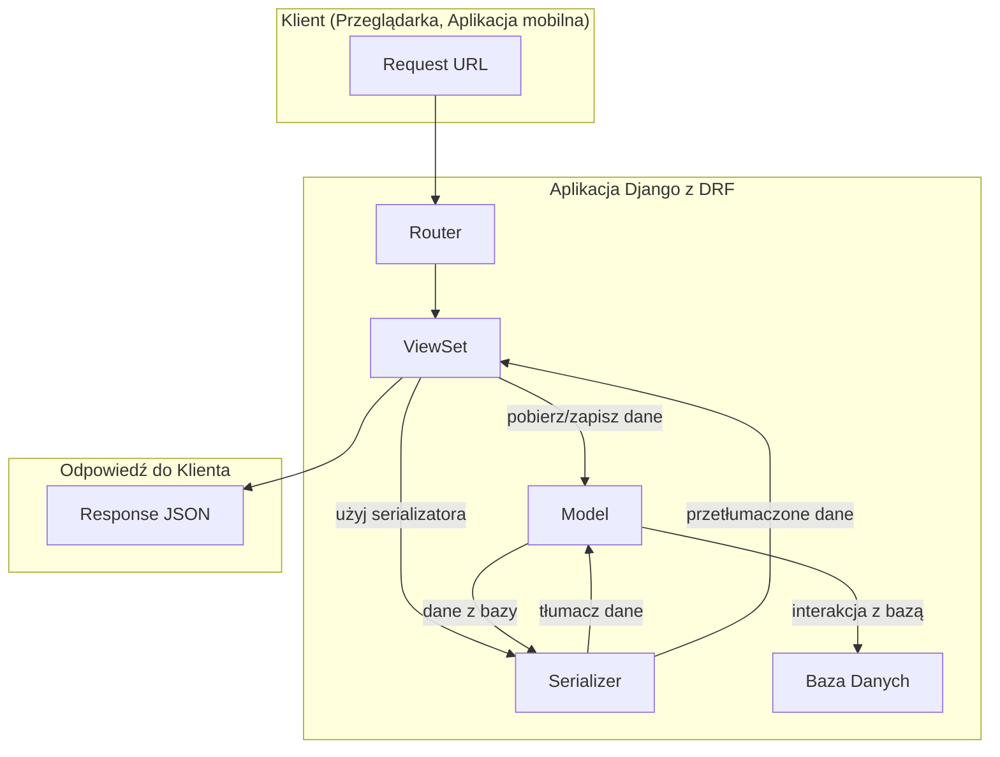
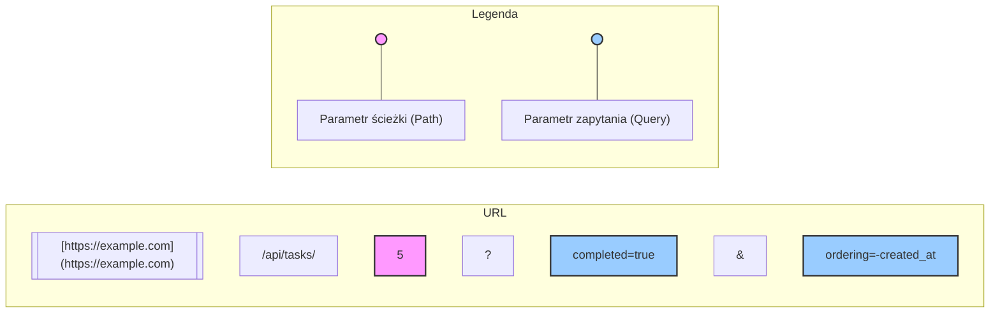

# **Lekcja 25: Wprowadzenie do Django REST Framework: Tworzenie API**

`#lekcja` `#python` `#django` `#drf` `#api` `#backend`

Witaj na kolejnej lekcji! Do tej pory tworzyliśmy aplikacje w Django, które renderowały szablony HTML i wyświetlały je użytkownikowi. Dziś zrobimy krok w zupełnie nowym kierunku: nauczymy się tworzyć API (Interfejs Programowania Aplikacji). Dzięki API nasza aplikacja będzie mogła komunikować się nie tylko z przeglądarką, ale też z innymi programami, aplikacjami mobilnymi czy serwisami internetowymi. Naszym narzędziem będzie potężna biblioteka **Django REST Framework (DRF)**.

## **1. Czym jest Django REST Framework (DRF)?**

> [!definition]
> 
> Django REST Framework (DRF) to potężna i elastyczna biblioteka do budowania webowych API w Django. Podczas gdy standardowe Django jest stworzone do budowy kompletnych stron internetowych (backend + frontend w postaci szablonów), DRF skupia się wyłącznie na backendzie, pozwalając na udostępnianie i zarządzanie danymi w uniwersalnym formacie, takim jak JSON.

Pomyśl o tym w ten sposób: Twoja aplikacja Django to restauracja.

- **Standardowe Django:** To restauracja, która ma własną kuchnię (backend), kelnerów (widoki) i salę dla gości, gdzie podaje gotowe dania na talerzach (szablony HTML).
    
- **Django REST Framework:** To ta sama kuchnia (backend), ale zamiast serwować dania na miejscu, przygotowuje je na wynos w standardowych, szczelnie zamkniętych opakowaniach (JSON). Dzięki temu jedzenie może odebrać dowolny dostawca (aplikacja mobilna, inna strona internetowa, narzędzie do testowania) i dostarczyć je swojemu klientowi.
    

### Architektura DRF

Architektura DRF opiera się na trzech głównych warstwach, które współpracują z modelami Django:

1. **Serializer (Serializator):** Tłumaczy dane z bazy (np. obiekty modeli Django) na format, który można łatwo przesyłać przez internet (np. JSON) i odwrotnie.
    
2. **View / ViewSet (Widok):** Określa, jakie operacje (odczyt, zapis, aktualizacja, usunięcie) są dostępne dla danych. To tutaj znajduje się cała logika biznesowa.
    
3. **Router (Router):** Automatycznie generuje adresy URL (endpointy) na podstawie widoków (ViewSetów), łącząc logikę z konkretnym adresem w internecie.
    




![[Screenshot 2025-09-12 at 14.49.40.png]]


## **2. Serializery (Serializers) - Tłumacze danych**

> [!definition]
> 
> Serializator w DRF konwertuje złożone typy danych, takie jak instancje modeli Django i QuerySety, na natywne typy danych Pythona (np. słowniki, listy), które następnie mogą być łatwo wyrenderowane do formatu JSON, XML lub innego. Działają również w drugą stronę, walidując i przekształcając przychodzące dane (np. z JSON) na obiekty Pythona.

Serializery są bardzo podobne do klas `Form` i `ModelForm` w Django. Służą do opisu danych, które mają być przesłane.

### `ModelSerializer`

Najczęściej będziemy używać klasy `ModelSerializer`, która automatycznie generuje pola serializatora na podstawie zdefiniowanego modelu.

Załóżmy, że mamy prosty model `Task`:

```python
# models.py
from django.db import models

class Task(models.Model):
    title = models.CharField(max_length=200)
    description = models.TextField(blank=True, null=True)
    completed = models.BooleanField(default=False)
    created_at = models.DateTimeField(auto_now_add=True)

    def __str__(self):
        return self.title
```

Aby stworzyć dla niego serializator, tworzymy plik `serializers.py` w naszej aplikacji i piszemy:

```python
# serializers.py
from rest_framework import serializers
from .models import Task

class TaskSerializer(serializers.ModelSerializer):
    class Meta:
        model = Task  # Wskazujemy, który model ma być serializowany
        fields = ['id', 'title', 'description', 'completed', 'created_at'] # Wybieramy pola do "tłumaczenia"
        # Można też użyć fields = '__all__' aby wybrać wszystkie pola
```

Teraz, gdy przekażemy obiekt `Task` do `TaskSerializer`, ten zamieni go na słownik, który DRF wyśle jako JSON, np.:

```python
{
    "id": 1,
    "title": "Nauczyć się DRF",
    "description": "Przerobić lekcję i zadania.",
    "completed": false,
    "created_at": "2025-09-12T14:30:00.123456Z"
}
```

## **3. Widoki i Routing - Logika i Adresy URL**

> [!info]
> 
> W DRF, podobnie jak w Django, widoki obsługują zapytania HTTP. Jednak DRF wprowadza ViewSety (ViewSet), które grupują logikę dla standardowych operacji (CRUD - Create, Read, Update, Delete) w jednej klasie.

Użycie `ModelViewSet` w połączeniu z `ModelSerializer` pozwala stworzyć kompletny endpoint API za pomocą zaledwie kilku linijek kodu.

```python
# views.py
from rest_framework import viewsets
from .models import Task
from .serializers import TaskSerializer

class TaskViewSet(viewsets.ModelViewSet):
    """
    API endpoint that allows tasks to be viewed or edited.
    """
    queryset = Task.objects.all().order_by('-created_at') # Jakie dane mają być dostępne
    serializer_class = TaskSerializer # Jakiego serializatora użyć do "tłumaczenia"
```

Teraz potrzebujemy tylko adresu URL. Zamiast ręcznie definiować każdy adres (dla listy, detali, tworzenia itd.), używamy `Routera`.

```python
# urls.py (w głównym folderze projektu)
from django.contrib import admin
from django.urls import path, include
from rest_framework import routers
from tasks_app import views # Załóżmy, że aplikacja nazywa się tasks_app

# Router automatycznie generuje dla nas adresy URL
router = routers.DefaultRouter()
router.register(r'tasks', views.TaskViewSet) # Zarejestruj nasz ViewSet pod adresem /tasks/

urlpatterns = [
    path('admin/', admin.site.urls),
    path('api/', include(router.urls)), # Wszystkie adresy API będą pod /api/
]
```

Dzięki temu prostemu setupowi DRF automatycznie stworzył dla nas następujące endpointy:

- `GET /api/tasks/` - pobranie listy wszystkich zadań
    
- `POST /api/tasks/` - stworzenie nowego zadania
    
- `GET /api/tasks/{id}/` - pobranie jednego zadania o konkretnym ID
    
- `PUT /api/tasks/{id}/` - aktualizacja zadania o konkretnym ID
    
- `DELETE /api/tasks/{id}/` - usunięcie zadania o konkretnym ID
    

## **4. Parametry w URL: Path vs Query Parameters**

Kiedy tworzymy API, musimy mieć sposób na precyzyjne określenie, jakich danych potrzebujemy. Służą do tego parametry przesyłane w adresie URL.

> [!definition]
> 
> Path Parameters (Parametry Ścieżki) to fragmenty ścieżki URL, które identyfikują konkretny zasób. Są częścią samej struktury adresu. W DRF routery automatycznie używają ich do identyfikacji obiektów po kluczu głównym (np. ID).
> 
> Przykład: /api/tasks/5/ - 5 to parametr ścieżki, który jednoznacznie identyfikuje zadanie o ID równym 5.

> [!definition]
> 
> Query Parameters (Parametry Zapytania) to pary klucz-wartość dodawane na końcu adresu URL po znaku ?. Służą do sortowania, filtrowania lub paginacji wyników, a nie do identyfikacji konkretnego zasobu.
> 
> Przykład: /api/tasks/?completed=true - completed=true to parametr zapytania, który prosi API o zwrócenie tylko tych zadań, które są ukończone.




![[Screenshot 2025-09-12 at 15.49.01.png]]


## **5. Postman - Twoje narzędzie do testowania API**

Skoro nasze API nie zwraca HTML, jak możemy je testować? Oczywiście, możemy użyć przeglądarki do zapytań `GET`, ale co z `POST`, `PUT`, `DELETE`? Tutaj z pomocą przychodzi **Postman**.

> [!tip]
> 
> Postman to darmowa aplikacja, która pozwala na wysyłanie dowolnych zapytań HTTP (GET, POST, PUT, DELETE itp.) pod wskazany adres URL. Możemy w niej ustawiać nagłówki, przesyłać dane (np. w formacie JSON) i analizować odpowiedzi z serwera. Jest to niezbędne narzędzie dla każdego backend developera.

**Jak używać Postmana?**

1. Pobierz i zainstaluj aplikację Postman.
    
2. Uruchom swój serwer deweloperski Django (`python manage.py runserver`).
    
3. W Postmanie:
    
    - Wybierz metodę HTTP (np. `GET`).
        
    - Wpisz adres URL swojego endpointu (np. `http://127.0.0.1:8000/api/tasks/`).
        
    - Kliknij "Send". W odpowiedzi powinieneś zobaczyć listę zadań w formacie JSON.
        
    - Aby stworzyć nowy task, zmień metodę na `POST`, przejdź do zakładki "Body", wybierz "raw" i "JSON", a następnie wpisz dane nowego zadania, np.:
        
        ```python
        {
            "title": "Przetestować POST w Postmanie",
            "description": "To jest super proste!"
        }
        ```
        
    - Kliknij "Send" i gotowe!
        

## **6. Ciasteczka (Cookies)**

> [!definition]
> 
> Cookies (ciasteczka) to małe fragmenty danych tekstowych, które serwer wysyła do przeglądarki, a przeglądarka przechowuje je na komputerze użytkownika. Przy każdym kolejnym zapytaniu do tego samego serwera, przeglądarka automatycznie odsyła zapisane ciasteczko.

Ciasteczka są powszechnie używane do:

- **Zarządzania sesją:** Identyfikują zalogowanego użytkownika (Django używa ich domyślnie!).
    
- **Personalizacji:** Zapamiętują preferencje użytkownika (np. język, waluta, ciemny motyw).
    
- **Śledzenia:** Analizują zachowanie użytkownika na stronie.
    

W Django (i DRF) możemy łatwo zarządzać ciasteczkami w widokach.

```python
# Przykład w widoku funkcyjnym DRF
from rest_framework.decorators import api_view
from rest_framework.response import Response

@api_view(['GET'])
def set_cookie_view(request):
    response = Response({"message": "Ciasteczko zostało ustawione!"})
    # Ustawiamy ciasteczko o nazwie 'username' i wartości 'student'
    # max_age to czas życia w sekundach
    response.set_cookie('username', 'student', max_age=3600) 
    return response

@api_view(['GET'])
def get_cookie_view(request):
    # Odczytujemy wartość ciasteczka 'username'
    username = request.COOKIES.get('username', 'Gość') 
    return Response({"message": f"Witaj, {username}!"})
```

> [!note]
> 
> Pamiętaj, że ciasteczka mają swoje ograniczenia (np. rozmiar, bezpieczeństwo). Wrażliwe dane, takie jak hasła, nigdy nie powinny być w nich przechowywane w czystym tekście.

## **🧪 Zadania do samodzielnej pracy**

### Zadania proste

1. ✏️ Zadanie 1 – Instalacja i konfiguracja
    
    (proste)
    
    Stwórz nowy projekt Django. Zainstaluj Django REST Framework (pip install djangorestframework) i dodaj 'rest_framework' do INSTALLED_APPS w ustawieniach projektu.
    
2. ✏️ Zadanie 2 – Prosty model i serializator
    
    (proste)
    
    W nowej aplikacji Django stwórz model Product z polami name (CharField) i price (DecimalField). Następnie stwórz dla niego ModelSerializer, który będzie uwzględniał oba te pola oraz id.
    
3. ✏️ Zadanie 3 – Pierwszy ViewSet i Router
    
    (proste)
    
    Stwórz ModelViewSet dla modelu Product. Podłącz go do głównego pliku urls.py za pomocą DefaultRouter pod adresem /api/products/. Uruchom serwer i wejdź na adres http://127.0.0.1:8000/api/products/ w przeglądarce. Co widzisz?
    
4. ✏️ Zadanie 4 – Testowanie w Postmanie
    
    (proste)
    
    Użyj Postmana, aby dodać 3 nowe produkty do swojej bazy danych za pomocą zapytania POST na endpoint /api/products/. Sprawdź, czy po wysłaniu zapytania GET pod ten sam adres, widzisz dodane produkty.
    
5. ✏️ Zadanie 5 – Widok z ciasteczkiem
    
    (proste)
    
    Stwórz dwa widoki funkcyjne i podłącz je pod adresy /api/hello/ i /api/set-name/. Widok set-name powinien przyjmować parametr zapytania name (np. /api/set-name/?name=Anna) i ustawiać ciasteczko o nazwie user_name z podaną wartością. Widok hello powinien odczytywać to ciasteczko i zwracać komunikat "Witaj, [imię]!" lub "Witaj, Gość!", jeśli ciasteczko nie istnieje.
    

### Zadania "Challenge"

6. 🧠 Zadanie 6 – API do notatek
    
    (challenge)
    
    Rozbuduj aplikację z zadania 1-3. Stwórz model Note z polami title, content (TextField) i created_at. Zbuduj dla niego pełne API (CRUD) używając ModelViewSet i ModelSerializer. Użyj Postmana do przetestowania wszystkich 5 operacji (lista, detal, tworzenie, aktualizacja, usuwanie).
    
7. 🧠 Zadanie 7 – API Kalkulatora
    
    (challenge)
    
    Stwórz widok funkcyjny (użyj dekoratora @api_view(['GET'])) pod adresem /api/calculate/. Widok powinien przyjmować trzy parametry zapytania: num1, num2 i operation (który może przyjąć wartości 'add', 'subtract', 'multiply', 'divide'). Widok powinien wykonać odpowiednią operację matematyczną i zwrócić wynik w formacie JSON, np. {"result": 15}. Zadbaj o obsługę błędów (np. dzielenie przez zero, niepoprawna operacja).
    
8. 🧠 Zadanie 8 – Filtrowanie i wyszukiwanie
    
    (challenge)
    
    W ViewSet dla produktów (z zadania 2) zaimplementuj filtrowanie po cenie. Chcemy móc wysyłać zapytania takie jak /api/products/?min_price=100&max_price=200, które zwrócą produkty w danym przedziale cenowym. Wskazówka: nadpisz metodę get_queryset w swoim ViewSet.
    
9. 🧠 Zadanie 9 – Relacje w API
    
    (challenge)
    
    Stwórz dwa modele: Author (name) i Book (title, publication_year oraz klucz obcy do Author). Stwórz serializatory i ViewSety dla obu modeli. Zmodyfikuj BookSerializer tak, aby przy wyświetlaniu książki pokazywał nazwę autora, a nie tylko jego ID. Wskazówka: poszukaj informacji o Nested Serializers lub StringRelatedField w dokumentacji DRF.
    
10. 🧠 Zadanie 10 – Własna walidacja w serializatorze
    
    (challenge)
    
    W serializatorze dla notatek (z zadania 6) dodaj własną metodę walidacji (validate_title), która sprawdzi, czy tytuł notatki nie jest krótszy niż 5 znaków. Jeśli jest, serializator powinien zwrócić błąd walidacji z odpowiednim komunikatem. Przetestuj działanie, próbując dodać za krótką notatkę przez Postmana.