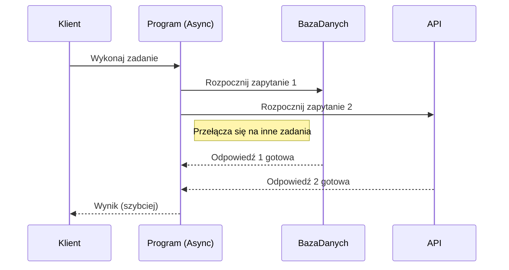
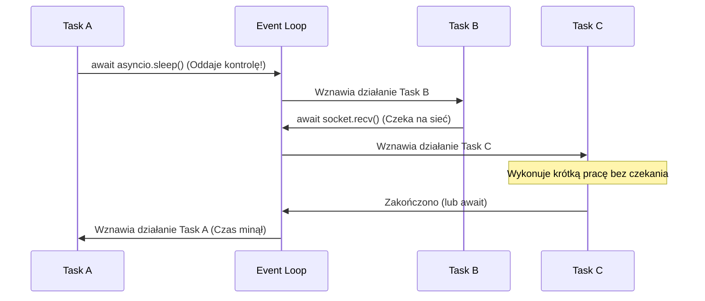

Oto zaktualizowana wersja lekcji, uwzględniająca wszystkie Twoje poprawki. Przebudowałem strukturę, dodałem brakujące koncepcje, przykłady i diagramy, aby stworzyć kompletny i logiczny przewodnik po asynchroniczności.

# **Lekcja 31: Asynchroniczność w Pythonie - Wprowadzenie do `asyncio**`

`#lekcja` `#python` `#asynchroniczność` `#asyncio` `#korutyny` `#programowanie-współbieżne` `#django`

W tej lekcji zanurzymy się w świat programowania asynchronicznego w Pythonie. Dowiesz się, jak pisać kod, który potrafi obsługiwać wiele operacji wejścia-wyjścia (I/O) współbieżnie, bez potrzeby używania wielu wątków czy procesów. Jest to kluczowa umiejętność w nowoczesnym backendzie, zwłaszcza przy budowie wydajnych aplikacji webowych, API czy botów. Wykorzystamy do tego wbudowany moduł `asyncio`.

## **1. Czym jest asynchroniczność?**

Do tej pory poznałeś dwa modele współbieżności: wielowątkowość i wieloprocesowość.

> [!warning] Ważne: Asynchroniczność to NIE równoległość
> Asynchroniczność w `asyncio` zapewnia **współbieżność (concurrency)**, ale zazwyczaj działa w obrębie **jednego wątku**. Nie polega ona na wykonywaniu kilku operacji w dokładnie tym samym ułamku sekundy (jak w wieloprocesowości), lecz na niezwykle szybkim **przełączaniu wykonywania** pomiędzy zadaniami.
> **Event Loop sam z siebie nie uruchamia nowych wątków.** Wszystkie korutyny wykonują się na tym samym wątku, dopóki świadomie nie użyjesz narzędzi takich jak `asyncio.to_thread()`, czy `ProcessPoolExecutor`.

Model ten jest idealny dla zadań **I/O-bound** (ograniczonych przez operacje wejścia/wyjścia), gdzie program spędza większość czasu na czekaniu na odpowiedź z zewnętrznych zasobów.

**Uwaga na CPU-bound:** `asyncio` **nie przyspieszy** intensywnych obliczeń matematycznych. Jedno ciężkie zadanie obliczeniowe zablokuje całą pętlę zdarzeń!

Wyobraź sobie kucharza w kuchni:

* **Synchronicznie:** Kucharz wstawia ziemniaki do gotowania i czeka 20 minut, nic nie robiąc. Po ugotowaniu smaży kotlet i czeka.
* **Asynchronicznie (współbieżnie):** Kucharz wstawia ziemniaki. Zamiast czekać, zaczyna smażyć kotlet. Kucharz obsługuje wszystko w jednym wątku, ale nie marnuje czasu na czekanie.



---

## **2. Słowa kluczowe `async` i `await**`

> [!info] Rola `async` i `await`
> * **`async def`**: Definiuje funkcję jako korutynę.
> * **`await`**: Oddaje kontrolę nad wątkiem do pętli zdarzeń, mówiąc: *"Teraz muszę poczekać na I/O, możesz w tym czasie zająć się czymś innym"*.
> 
> 

Słowo kluczowe `await` **może być użyte wyłącznie przed obiektami typu "awaitable"** (oczekiwane). Zalicza się do nich:

1. **Korutyny** (wynik wywołania `async def`).
2. Obiekty **Task** (zadania zaplanowane w pętli).
3. Obiekty **Future** (niskopoziomowe struktury oczekujące na wynik).

### Jak i kiedy następuje przełączenie?

Początkujący często zastanawiają się, kiedy dokładnie zadania się przełączają. Dzieje się to **tylko w momencie napotkania słowa `await**`. Poniższy schemat świetnie to ilustruje:



---

## **3. Korutyny (Coroutines)**

Korutyna to specjalny rodzaj funkcji, której wykonanie można wstrzymać i wznowić w późniejszym czasie.

```python
import asyncio

# Definicja korutyny za pomocą 'async def'
async def moja_korutyna():
    print("Witaj w świecie asynchroniczności!")

# Wywołanie funkcji nie uruchamia jej, tylko tworzy obiekt korutyny
korutyna_obj = moja_korutyna()
print(f"Typ obiektu: {type(korutyna_obj)}")

# Aby uruchomić korutynę, używamy asyncio.run()
asyncio.run(korutyna_obj)

```

---

## **4. Pętla zdarzeń (Event Loop)**

Sercem `asyncio` jest pętla zdarzeń (Event Loop). Działa jak dyrygent – nieskończona pętla, która sprawdza, które zadania są gotowe do uruchomienia, a które wciąż czekają na sieć lub dysk.

Funkcja `asyncio.run()` automatycznie tworzy nową pętlę zdarzeń, uruchamia główną korutynę i bezpiecznie zamyka pętlę po zakończeniu.

> [!danger] Blokowanie pętli zdarzeń (Najczęstszy błąd!)
> Jeśli wewnątrz asynchronicznego kodu użyjesz synchronicznej, blokującej funkcji (np. z modułu `time` lub `requests`), **zablokujesz cały główny wątek**. Pętla zdarzeń "zamrozi się" i żadne inne asynchroniczne zadanie nie będzie mogło się wykonać!
> * ❌ **ŹLE:** `time.sleep(5)` – Cały wątek stoi przez 5 sekund. Zero współbieżności.
> * ✔️ **DOBRZE:** `await asyncio.sleep(5)` – Zwraca kontrolę do pętli na 5 sekund. Inne zadania mogą w tym czasie pracować.
> 
> 

---

## **5. Moduł `asyncio`: Task**

Aby uruchomić wiele operacji współbieżnie (nie sekwencyjnie!), musimy użyć zadań — **Task**.
Obiekt Task "opakowuje" korutynę i natychmiast planuje jej wykonanie w pętli zdarzeń w tle. Tworzymy je za pomocą `asyncio.create_task()`.

Rozróżnij dwa sposoby wywołania:

* `await korutyna()` — Czeka na zakończenie korutyny przed przejściem do kolejnej linii. (Sekwencyjnie).
* `task = asyncio.create_task(korutyna())` — Planuje zadanie w pętli i przechodzi dalej bez czekania. Odbiór wyniku następuje później przez `await task`. (Współbieżnie).

```python
import asyncio
import time

async def pobierz_dane(id):
    await asyncio.sleep(2)
    return {"id": id, "name": "Kowalski"}

async def pobierz_zamowienia(id):
    await asyncio.sleep(3)
    return ["książka", "długopis"]

async def main():
    start = time.perf_counter()
    
    # Tworzymy zadania - natychmiast startują w tle!
    task_dane = asyncio.create_task(pobierz_dane(1))
    task_zamowienia = asyncio.create_task(pobierz_zamowienia(1))
    
    # Czekamy na wyniki pobierane współbieżnie
    dane = await task_dane
    zamowienia = await task_zamowienia
    
    print(f"Całkowity czas: {time.perf_counter() - start:.2f}s") 
    # Czas wykonania to ~3s (maksimum z obu opóźnień), a nie 5s!

asyncio.run(main())

```

---

## **6. TaskGroup (Python 3.11+)**

Od wersji Python 3.11 do zarządzania zadaniami wprowadzono **`TaskGroup`**. Upraszcza to kod i zapobiega wyciekom zadań. Jeśli jeden z tasków zgłosi błąd, `TaskGroup` bezpiecznie anuluje pozostałe zadania z tej samej grupy.

```python
import asyncio

async def zadanie(id, czas):
    await asyncio.sleep(czas)
    return f"Wynik {id}"

async def main():
    async with asyncio.TaskGroup() as tg:
        # Rejestrujemy taski. TaskGroup zatrzyma nas na wyjściu z bloku `with` 
        # do momentu zakończenia wszystkich zaplanowanych tutaj zadań.
        t1 = tg.create_task(zadanie(1, 1))
        t2 = tg.create_task(zadanie(2, 2))
        
    print(t1.result())
    print(t2.result())

asyncio.run(main())

```

---

## **7. Synchronizacja i zarządzanie zadaniami**

Często pracujemy z dynamicznymi listami zadań. `asyncio` dostarcza do tego świetne narzędzia.

### **asyncio.gather()**

Najpopularniejszy sposób na uruchomienie wielu korutyn na raz i spakowanie ich wyników do jednej listy (w odpowiedniej kolejności).

> [!important] Zachowanie w przypadku błędów
> Jeśli któraś korutyna wewnątrz `gather` rzuci wyjątek, przerwie to wywołanie `gather` i wyjątek zostanie wyrzucony w miejscu wywołania. **UWAGA:** pozostałe zadania będą nadal działać w tle! Jeśli chcesz otrzymać wyjątki na liście jako obiekty (bez przerywania `gather`), dodaj flagę `return_exceptions=True`.

### **asyncio.wait() vs asyncio.gather()**

* **`gather()`**: Czeka na *wszystkie* zadania i zwraca elegancką listę wyników.
* **`wait()`**: Niskopoziomowa alternatywa. Pozwala reagować na zdarzenia przed końcem wszystkich zadań. Używając parametru `return_when=asyncio.FIRST_COMPLETED`, możesz przerwać czekanie gdy tylko *pierwsze* z wielu zadań się zakończy. Zwraca zbiór ukończonych i zbiór wciąż działających zadań.

### **asyncio.wait_for() (Timeout)**

Pozwala narzucić maksymalny czas na wykonanie korutyny.

```python
import asyncio

async def dlugie_zadanie():
    await asyncio.sleep(5)

async def main():
    try:
        await asyncio.wait_for(dlugie_zadanie(), timeout=2.0)
    except asyncio.TimeoutError:
        print("Zadanie trwało zbyt długo i zostało przerwane!")

asyncio.run(main())

```

### **Anulowanie zadań (Cancellation)**

Taski działające w tle można ręcznie przerywać.

```python
import asyncio

async def pracownik():
    try:
        while True:
            print("Pracuję...")
            await asyncio.sleep(1)
    except asyncio.CancelledError:
        print("Zostałem anulowany! Sprzątam po sobie...")

async def main():
    task = asyncio.create_task(pracownik())
    await asyncio.sleep(3) 
    
    task.cancel()  # Wymuszamy zatrzymanie
    await task     # Upewniamy się, że się poprawnie zakończył

asyncio.run(main())

```

---

## **8. Kontrola przepływu: Semaphore**

Uruchomienie współbieżnie 10 000 zapytań API zazwyczaj kończy się blokadą IP. Do limitowania jednoczesnej aktywności służy **Semaphore**. Chroni on fragment kodu i wpuszcza do niego jednocześnie tylko zadaną liczbę zadań.

```python
import asyncio
import time

# Tylko 2 taski na raz będą mogły przejść przez barierę
limit = asyncio.Semaphore(2)

async def bezpiecznie_pobierz(url):
    async with limit:  
        print(f"Pobieram: {url}")
        await asyncio.sleep(2) # Symulacja obciążenia
        return url

async def main():
    urls = [f"http://api.com/page={i}" for i in range(5)]
    # Mimo zlecenia 5 zadań na raz, wykonają się one w paczkach po 2.
    await asyncio.gather(*(bezpiecznie_pobierz(url) for url in urls))

asyncio.run(main())

```

---

## **9. Delegowanie do wątków: `asyncio.to_thread()**`

Co zrobić, gdy MUSISZ użyć starej, synchronicznej biblioteki (np. `requests` do zawiłego uwierzytelniania) albo wykonać ciężkie obliczenia, nie blokując przy tym pętli zdarzeń? Z pomocą przychodzi wprowadzona w Pythonie 3.9 funkcja `asyncio.to_thread()`.

Wrzuca ona synchroniczne zadanie do osobnego, roboczego wątku w tle i pozwala użyć na nim `await`, by Event Loop mógł działać dalej.

```python
import asyncio
import requests
import time

def stare_ciezkie_zrodlo(url):
    # BLOKUJĄCA operacja sieciowa
    response = requests.get(url)
    return response.status_code

async def main():
    print("Zaczynam...")
    
    # Uruchamiamy powolną, blokującą funkcję w oddzielnym wątku
    wynik = await asyncio.to_thread(stare_ciezkie_zrodlo, "https://httpbin.org/delay/2")
    
    print(f"Zakończono ze statusem: {wynik}")

asyncio.run(main())

```

---

## **10. Zastosowanie AI w programowaniu asynchronicznym**

Wysyłanie zapytań do modeli (np. OpenAI) to klasyczne zadanie I/O. Zamiast czekać po kilkanaście sekund na odpowiedź modelu w sposób synchroniczny, asynchroniczność pozwala wysłać setki zapytań naraz.

```python
import asyncio
import random
import time

async def popros_ai(tekst):
    # Symulacja czekania na odpowiedź od serwerów AI (np. OpenAI)
    await asyncio.sleep(random.uniform(1, 4)) 
    return {"tekst": tekst, "sentyment": "pozytywny"}

async def main():
    zdania = ["Film był super!", "Ale nudy.", "Przeciętnie."]
    start_time = time.perf_counter()
    
    wyniki = await asyncio.gather(*(popros_ai(z) for z in zdania))
    
    for w in wyniki:
        print(w)
    print(f"Całkowity czas analizy: {time.perf_counter() - start_time:.2f}s")

asyncio.run(main())

```

---

## **11. Asynchroniczność w praktyce: Przykład z Django**

Od wersji 3.1 Django wspiera asynchroniczne widoki, a od 4.1 pełne asynchroniczne odpytywanie bazy ORM (np. przez `aget()`). Pozwala to na jednoczesne operowanie na bazie danych i sieci.

Porównajmy sekwencyjne i współbieżne podejście do tego samego problemu w nowoczesnym Django:

```python
import asyncio
import httpx
from django.http import JsonResponse
from myapp.models import Article

async def fetch_stats(article_id):
    async with httpx.AsyncClient(timeout=10) as client:
        response = await client.get(f"https://api.com/stats/{article_id}")
        return response.json()

async def article_detail_view(request, article_id):
    # PODEJŚCIE 1: Sekwencyjne (dobre, ale wolniejsze)
    # article = await Article.objects.aget(id=article_id) # <- czeka
    # stats = await fetch_stats(article_id)             # <- czeka później
    
    # PODEJŚCIE 2: Współbieżne zapytanie do Bazy i do API (Szybsze!)
    # Odpalamy zapytanie SQL i HTTP równolegle w tle:
    article_task = asyncio.create_task(Article.objects.aget(id=article_id))
    stats_task = asyncio.create_task(fetch_stats(article_id))
    
    # Czekamy na oba naraz:
    article = await article_task
    stats = await stats_task
    
    return JsonResponse({
        "title": article.title,
        "views": stats.get('views', 0)
    })

```

Czas odpowiedzi serwera przy drugim podejściu to zaledwie czas wolniejszej z tych dwóch operacji, a nie ich suma!

---

## **12. Asynchroniczne żądania HTTP (`httpx` i `aiohttp`)**

Dobrą praktyką przy operacjach sieciowych jest używanie bibliotek, które natywnie wspierają `async/await`. Dla większości projektów najlepszym zamiennikiem dla popularnego `requests` jest **`httpx`**.

> [!important] Dobra praktyka: Zawsze definiuj timeout!
> Zewnętrzne API potrafią "wisieć". Pozostawienie asynchronicznego żądania bez ograniczenia czasowego spowoduje, że Twój task nigdy się nie zakończy.

```python
import asyncio
import httpx
import time

async def fetch_httpx(url: str, client: httpx.AsyncClient):
    response = await client.get(url)
    return response.status_code

async def main():
    urls = ["https://httpbin.org/delay/1"] * 3
    
    # Włączamy globalny timeout = 10 sekund dla klienta
    async with httpx.AsyncClient(timeout=10.0) as client:
        zadania = [fetch_httpx(url, client) for url in urls]
        wyniki = await asyncio.gather(*zadania)
        
    print(f"Wyniki: {wyniki}")

if __name__ == "__main__":
    asyncio.run(main())

```

```python
import asyncio
import aiohttp

async def fetch_aiohttp(url: str, session: aiohttp.ClientSession):
    async with session.get(url) as response:
        return response.status

async def main():
    urls = ["https://httpbin.org/delay/1"] * 3

    timeout = aiohttp.ClientTimeout(total=10)

    async with aiohttp.ClientSession(timeout=timeout) as session:
        tasks = [fetch_aiohttp(url, session) for url in urls]
        results = await asyncio.gather(*tasks)

    print(f"Wyniki: {results}")

if __name__ == "__main__":
    asyncio.run(main())
```

---

## **13. Moduł `asyncio`: Future (Ciekawostka niskopoziomowa)**

Z obiektami typu **Future** rzadko spotkasz się bezpośrednio (zazwyczaj operujemy na ich podklasie, czyli `Task`). Są one technicznie absolutnym fundamentem mechanizmu `asyncio`. Czym zatem jest `Future`?

To niskopoziomowy obiekt – swego rodzaju "puste pudełko z obietnicą".
Tworzysz pudełko, używasz `await` (co usypia korutynę), i czekasz, aż całkowicie niezależny kawałek kodu wrzuci do niego wynik przez wywołanie `.set_result(wynik)`. Kiedy to się stanie, śpiąca korutyna budzi się i wznawia działanie z gotowymi danymi.

Dziś `Future` tworzy się ręcznie niemal wyłącznie wtedy, gdy trzeba spiąć z nowym kodem `async/await` stare, asynchroniczne biblioteki oparte na *callbackach*.

---

## **14. Najczęstsze błędy (Podsumowanie)**

Podsumujmy kluczowe rzeczy, na których nowi programiści tracą najwięcej czasu:

| Reguła              | ✔️ Dobrze                              | ❌ Źle           | Dlaczego to problem?                                                     |
| ------------------- | ------------------------------------- | --------------- | ------------------------------------------------------------------------ |
| **Pauza / Sen**     | `await asyncio.sleep(1)`              | `time.sleep(1)` | `time.sleep` blokuje cały wątek roboczy. Zatrzymuje pętlę zdarzeń!       |
| **Żądania HTTP**    | `httpx.AsyncClient` lub `aiohttp`     | `requests`      | Moduł `requests` jest z natury synchroniczny, nie oddaje kontroli pętli. |
| **Odpalanie w tle** | `task = asyncio.create_task(f())`<br> |

<br>`await task` | `asyncio.create_task(f())` | Jeśli "zgubisz" task bez odczytania błędu przez `await`, program po cichu ukryje wyjątki. |
| **Kontekst** | `async with aiofiles.open(...)` | `with open(...)` | Otwieranie / czytanie dużych plików blokuje I/O. Używaj asynchronicznych menedżerów kontekstu. |
| **Uruchomienie** | Wywoływane tylko raz zewnątrz | Zagnieżdżanie `asyncio.run()` | Funkcji `asyncio.run()` nie wywołuje się wewnątrz już działającej korutyny. |

---

## **15. 🧪 Zadania do samodzielnej pracy**

### **Zadania proste**

1. ✏️ **Pierwsza korutyna:** Napisz korutynę, która po uruchomieniu wypisze "Gotowy do nauki!". Uruchom ją.
2. ✏️ **Asynchroniczny licznik:** Napisz korutynę `licznik(n)`, która co sekundę wypisuje liczby od 1 do n używając `await asyncio.sleep(1)`.
3. ✏️ **Dwa zadania po kolei:** Stwórz `zadanie1` (śpi 2s) i `zadanie2` (śpi 1s). Wykonaj je sekwencyjnie.
4. ✏️ **Dwa zadania współbieżnie:** Zmodyfikuj zadanie 3 – użyj `asyncio.gather()`. Zmierz i porównaj czas.
5. ✏️ **Korutyna zwracająca wartość:** Napisz `oblicz_potege(liczba, potega)` (2s opóźnienia) i zwróć wynik.
6. ✏️ **Symulacja pobierania danych:** Napisz korutynę `pobierz_pogode(miasto)` z 1.5s uśpieniem i słownikiem zwrotnym.
7. ✏️ **Wiele miast:** Wywołaj `pobierz_pogode` współbieżnie dla 3 różnych miast.
8. ✏️ **Asynchroniczny ping:** Napisz `ping(host)`, śpiący losowy czas i zwracający potwierdzenie. Uruchom dla 5 hostów.

### **Zadania trudniejsze (challenge)**

9. 🧠 **Pobieranie statusów HTTP:** Używając `httpx` zbadaj kody statusów dla listy podanych URLi.
10. 🧠 **Współbieżne odliczanie:** Zbuduj 3 korutyny zliczające czas w dół i wypisujące go, każda pracująca niezależnie, z różnym czasem początkowym.
11. 🧠 **Sumowanie wyników zadań:** Stwórz 10 zadań losujących wynik po 2-5s. Użyj gather i wysumuj rezultaty.
12. 🧠 **Kto pierwszy, ten lepszy:** Użyj `asyncio.wait()` na 5 zadaniach z parametrem `FIRST_COMPLETED`. Wypisz wynik tego, które skończyło jako pierwsze.
13. 🧠 **Prosty serwer echa:** Napisz serwer TCP na `localhost:8888` za pomocą `asyncio.start_server()`.
14. 🧠 **Kolejka producent-konsument:** Połącz zadania kolejką `asyncio.Queue` (1 ładuje liczby, 2 przetwarza je w locie).
15. 🧠 **Asynchroniczny zapis do pliku:** Użyj `asyncio.Lock` i biblioteki `aiofiles`, aby 5 zadań bezpiecznie pisało logi do jednego pliku.
16. 🧠 **Integracja synchroniczna:** Napisz program odczytujący 100 małych plików z dysku asynchronicznie, wykorzystując systemowe IO przez `asyncio.to_thread`.
17. 🧠 **Łańcuch zależności:** Napisz kaskadę: pobranie User ID -> pobranie wpisów -> pobranie komentarzy. Używaj gather dla list na końcu łańcucha.
18. 🧠 **Anulowanie zadania:** Uruchom task z pętlą while(True), w głównym programie wymuś po 5 sekundach `.cancel()` i przechwyć ten błąd asynchronicznie w samym tasku.
19. 🧠 **Generator asynchroniczny:** Użyj pętli `async for` wraz z słowem kluczowym `yield` asynchronicznie produkującym nowe dane.
20. 🧠 **Timeout dla zadania:** Uśpij zadanie na losowy czas (1-5s). Zabezpiecz go używając `wait_for` z timeout=3, obsłuż poprawnie `TimeoutError`.