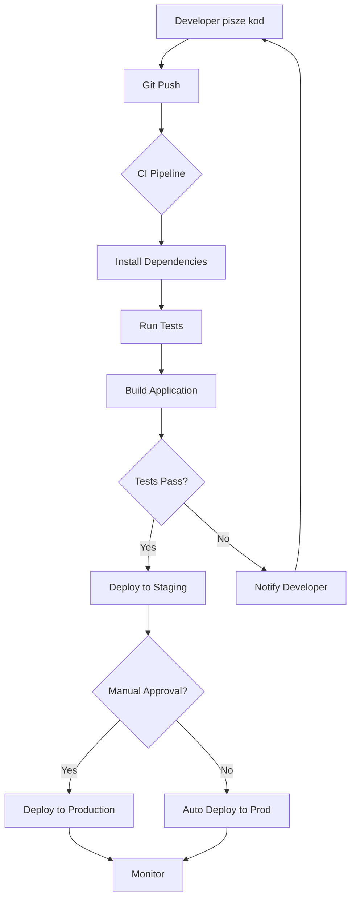
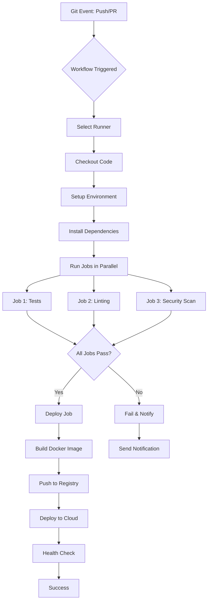
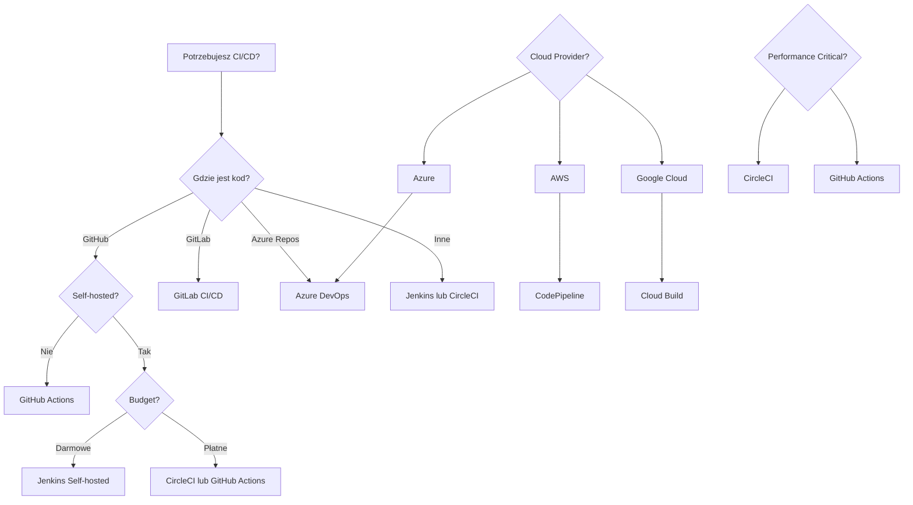

# **Lekcja 38: CI/CD i GitHub Actions**

`#lekcja` `#python` `#cicd` `#github-actions` `#devops` `#automation`

W tej lekcji poznamy podstawy CI/CD (Continuous Integration/Continuous Deployment) – kluczowego procesu w nowoczesnym rozwoju oprogramowania. Nauczymy się automatyzować testy, budowanie i wdrażanie aplikacji przy użyciu GitHub Actions oraz poznamy alternatywne narzędzia CI/CD.


---

## **1. Wprowadzenie do CI/CD**

> [!definition]
> **CI/CD** (Continuous Integration/Continuous Deployment) to zestaw praktyk DevOps, które automatyzują proces integracji kodu, testowania i wdrażania aplikacji. CI skupia się na częstym łączeniu zmian w kodzie, a CD na automatycznym dostarczaniu aplikacji do środowisk produkcyjnych.

### Wprowadzenie

CI/CD to fundament nowoczesnego rozwoju oprogramowania. Pozwala zespołom dostarczać zmiany szybciej, bezpieczniej i z większą pewnością jakości. Zamiast ręcznego uruchamiania testów i deployu, cały proces jest zautomatyzowany.

**Korzyści z CI/CD:**
- Szybsze wykrywanie błędów
- Automatyczne testy przy każdej zmianie
- Redukcja konfliktów w kodzie
- Szybsze dostarczanie funkcjonalności
- Większa pewność jakości kodu
- Automatyzacja powtarzalnych zadań

### Przykład 1: Tradycyjny proces vs CI/CD

```python
# Tradycyjny proces (przed CI/CD)
"""
1. Developer pisze kod lokalnie
2. Ręcznie uruchamia testy: python -m pytest
3. Commituję do repozytorium
4. Inny developer pobiera zmiany
5. Konflikty i błędy wykrywane późno
6. Ręczny deploy na serwer
"""

# Proces z CI/CD
"""
1. Developer pisze kod lokalnie
2. Push do repozytorium
3. CI/CD automatycznie:
   - Uruchamia testy
   - Sprawdza jakość kodu (linting)
   - Buduje aplikację
   - Deploy do środowiska testowego
   - Deploy do produkcji (jeśli wszystko OK)
4. Natychmiastowy feedback o problemach
5. Automatyczne powiadomienia
"""

# Przykładowa struktura projektu z CI/CD
"""
my-python-project/
├── .github/
│   └── workflows/
│       ├── test.yml          # Workflow dla testów
│       ├── deploy.yml        # Workflow dla deploymentu
│       └── lint.yml          # Workflow dla code quality
├── src/
│   └── app.py
├── tests/
│   └── test_app.py
├── requirements.txt
├── Dockerfile
└── README.md
"""
```

### Przykład 2: Pipeline CI/CD - Etapy

```python
# Pipeline CI/CD składa się z kilku etapów (stages)
# Każdy etap wykonuje określone zadania

# Stage 1: BUILD (Budowanie)
"""
- Instalacja zależności
- Kompilacja kodu (jeśli potrzebna)
- Tworzenie artefaktów (np. Docker image)
"""

# Stage 2: TEST (Testowanie)
"""
- Unit testy
- Integration testy
- Coverage report
- Code quality checks (linting, type checking)
"""

# Stage 3: DEPLOY (Wdrożenie)
"""
- Deploy do środowiska staging
- Smoke tests
- Deploy do produkcji (manual approval lub automatyczny)
"""

# Stage 4: MONITOR (Monitorowanie)
"""
- Health checks
- Metryki aplikacji
- Alerty w przypadku problemów
"""

# Przykład prostego skryptu testowego
# tests/test_app.py
def test_addition():
    """Test prostej funkcji dodawania"""
    assert 2 + 2 == 4

def test_api_endpoint():
    """Test endpointu API"""
    from app import app
    client = app.test_client()
    response = client.get('/health')
    assert response.status_code == 200
    assert response.json == {'status': 'healthy'}
```

### Przykład 3: Podstawowe koncepcje CI/CD

```python
# 1. Continuous Integration (CI)
"""
Praktyka częstego łączenia zmian w kodzie do głównej gałęzi.
Przy każdym push automatycznie uruchamiane są testy.
"""

# 2. Continuous Delivery (CD)
"""
Kod jest zawsze w stanie gotowym do wdrożenia.
Deploy wymaga ręcznej akcji (kliknięcie przycisku).
"""

# 3. Continuous Deployment (CD)
"""
Każda zmiana, która przejdzie testy, automatycznie
trafia na produkcję bez interwencji człowieka.
"""

# Przykład: Konfiguracja testów lokalnych
# pytest.ini
"""
[pytest]
testpaths = tests
python_files = test_*.py
python_functions = test_*
addopts =
    --verbose
    --cov=src
    --cov-report=html
    --cov-report=term
"""

# Przykład: Pre-commit hooks (przed CI/CD)
# .pre-commit-config.yaml
"""
repos:
  - repo: https://github.com/psf/black
    rev: 23.0.0
    hooks:
      - id: black
        language_version: python3.11

  - repo: https://github.com/pycqa/flake8
    rev: 6.0.0
    hooks:
      - id: flake8
        args: [--max-line-length=88]
"""
```

### Schemat działania CI/CD



> [!tip]
> **Best Practices dla CI/CD:**
> - Utrzymuj testy szybkie (< 10 minut)
> - Jeden branch, jeden pipeline
> - Używaj cache dla zależności
> - Monitoruj metryki pipeline
> - Implementuj rollback strategy

> [!warning]
> **Częste błędy:**
> - Testy są zbyt wolne (pipeline > 30 min)
> - Brak testów integracyjnych
> - Deploy bez rollback plan
> - Brak monitoringu po deploy
> - Hardcoded secrets w kodzie

---

## **gitPre commit/prepush**

git hooks wymagają chmod +x i shebang `#!/usr/bin/env bash` (`#!/bin/sh` dla windows)

pre-commit to narzędzie uruchamiające automatyczne sprawdzenia przed wykonaniem operacji Git, najczęściej przed git commit.

`pip install pre-commit` | `uv add --dev pre-commit`

```yml
.pre-commit-config.yaml
repos:
  - repo: https://github.com/astral-sh/ruff-pre-commit
    rev: v0.13.0
    hooks:
      - id: ruff-check
      - id: ruff-format

  - repo: https://github.com/pre-commit/pre-commit-hooks
    rev: v5.0.0
    hooks:
      - id: trailing-whitespace
      - id: end-of-file-fixer
```

## **2. GitHub Actions**

> [!definition]
> **GitHub Actions** to wbudowana w GitHub platforma CI/CD, która pozwala automatyzować workflow bezpośrednio w repozytorium. Używa plików YAML do definiowania zadań (jobs) i kroków (steps), które są wykonywane w odpowiedzi na eventy (np. push, pull request).

### Wprowadzenie

GitHub Actions to najpopularniejsze narzędzie CI/CD dla projektów hostowanych na GitHub. Jest darmowe dla publicznych repozytoriów i oferuje 2000 minut miesięcznie dla prywatnych.

**Podstawowe koncepcje:**
- **Workflow** – zdefiniowany proces automatyzacji
- **Event** – trigger uruchamiający workflow (push, PR, schedule)
- **Job** – zestaw kroków wykonywanych na jednym runnerze
- **Step** – pojedyncze zadanie w job (uruchomienie komendy lub akcji)
- **Action** – reużywalna jednostka kodu (community lub własna)
- **Runner** – maszyna wirtualna wykonująca workflow
- **Artifacts** - pliki powstałe w związku z wykonaniem Akcji (np. wyniki testów, build aplikacji)

### CI - od czego zacząć?

Pipeline powinniśmy zacząć budować od od podstawowego workflow, np. od powiązania push i pull request z testami.


Zacznijmy od stworzenia `.github/workflows/` w katalogu projektu - ścieżka jest automatycznie wykrywana przez github, a każdy plik `.yml` w nim zawarty jest rejestrowany jako osobne workflow.


Przykładowy plik uruchamiający testy i zapisujący wynik jako artefakt.

```yml
# .github/workflows/ci.yml
name: Python Tests

on:
  push:

jobs:
  test:
    runs-on: ubuntu-latest

    steps:
      # Pobranie kodu repozytorium
      - name: Checkout repository
        uses: actions/checkout@v4

      # Instalacja Pythona
      - name: Set up Python
        uses: actions/setup-python@v5
        with:
          python-version: "3.12"

      # Instalacja zależności
      - name: Install dependencies
        run: |
          python -m pip install --upgrade pip
          pip install -r requirements.txt
          pip install pytest pytest-json-report

      # Uruchomienie testów
      - name: Run tests
        run: |
          mkdir -p reports
          pytest tests \
            --json-report \
            --json-report-file=reports/test-report.json

      # Zapisanie raportu jako artefakt
      - name: Upload test report
        if: always()
        uses: actions/upload-artifact@v4
        with:
          name: test-report
          path: reports/
```

przykładowy workflow z cd:


```yml
name: Build and Deploy

on:
  push:
    branches:
      - main

env:
  REGISTRY: ghcr.io
  IMAGE_NAME: your_github_username/your_project_name

jobs:

  build:
    runs-on: ubuntu-latest

    permissions: # uprawnienia wygenerowanego tokenu github
      contents: read # permisions - uprawnienia do zawartosci repo
      packages: write # packages - uprawnienia do serwisów githuba jak ghcr.io

    outputs:
    # wynikiem tego job'a ,a buć 
      image: ${{ steps.metadata.outputs.tags }}

    steps:

      - name: Checkout source
        uses: actions/checkout@v4

      - name: Configure Docker Buildx
        uses: docker/setup-buildx-action@v3

      - name: Login to GitHub Container Registry
        uses: docker/login-action@v3
        with:
          registry: ${{ env.REGISTRY }}
          username: ${{ github.actor }}
          password: ${{ secrets.GITHUB_TOKEN }}

      - name: Build test image
        run: |
          docker build -t your_project_name:test .

      - name: Run tests
        run: |
          docker run --rm your_project_name:test pytest

      - name: Generate image tags
        id: metadata
        uses: docker/metadata-action@v5
        with:
          images: ${{ env.REGISTRY }}/${{ env.IMAGE_NAME }}
          tags: |
            type=sha
            type=raw,value=latest

      - name: Build and push image
        uses: docker/build-push-action@v6
        with:
          context: .
          push: true
          tags: ${{ steps.metadata.outputs.tags }}

  deploy:
    # uzależenienie job'a od innego.
    needs: build

    runs-on: ubuntu-latest

    steps:

      - name: Deploy application
        uses: appleboy/ssh-action@v1
        with:
          host: ${{ secrets.PRODUCTION_HOST }}
          username: ${{ secrets.PRODUCTION_USER }}
          key: ${{ secrets.PRODUCTION_SSH_PRIVATE_KEY }}

          script: |
            docker login ghcr.io \
              -u your_github_username \
              -p ${{ secrets.GHCR_READ_TOKEN }}

            docker pull ghcr.io/your_github_username/your_project_name:sha-${{ github.sha }}

            cd /opt/your_project_name

            docker compose up -d

            docker image prune -f
```

### Przykład 1: Pierwszy workflow - Uruchamianie testów

```yaml
# .github/workflows/test.yml
name: Run Tests

# Event: kiedy uruchomić workflow
on:
  push:
    branches: [ main, develop ]  # Na push do main lub develop
  pull_request:
    branches: [ main ]  # Na PR do main

# Jobs: co wykonać
jobs:
  test:
    # Runner: na jakiej maszynie uruchomić
    runs-on: ubuntu-latest

    # Strategy: testuj na wielu wersjach Python
    strategy:
      matrix:
        python-version: ['3.9', '3.10', '3.11']

    # Steps: kroki do wykonania
    steps:
      # Krok 1: Pobierz kod z repozytorium
      - name: Checkout code
        uses: actions/checkout@v3

      # Krok 2: Zainstaluj Python
      - name: Set up Python ${{ matrix.python-version }}
        uses: actions/setup-python@v4
        with:
          python-version: ${{ matrix.python-version }}

      # Krok 3: Cache zależności dla szybszego buildu
      - name: Cache pip dependencies
        uses: actions/cache@v3
        with:
          path: ~/.cache/pip
          key: ${{ runner.os }}-pip-${{ hashFiles('**/requirements.txt') }}
          restore-keys: |
            ${{ runner.os }}-pip-

      # Krok 4: Zainstaluj zależności
      - name: Install dependencies
        run: |
          python -m pip install --upgrade pip
          pip install pytest pytest-cov flake8
          if [ -f requirements.txt ]; then pip install -r requirements.txt; fi

      # Krok 5: Uruchom linting
      - name: Lint with flake8
        run: |
          # Zatrzymaj build jeśli są błędy składni
          flake8 . --count --select=E9,F63,F7,F82 --show-source --statistics
          # Ostrzeżenia (nie zatrzymują buildu)
          flake8 . --count --exit-zero --max-complexity=10 --max-line-length=88 --statistics

      # Krok 6: Uruchom testy
      - name: Run tests with pytest
        run: |
          pytest tests/ --cov=src --cov-report=xml --cov-report=term

      # Krok 7: Upload coverage do CodeCov (opcjonalnie)
      - name: Upload coverage to Codecov
        uses: codecov/codecov-action@v3
        with:
          file: ./coverage.xml
          fail_ci_if_error: false
```

**Wyjaśnienie:**
- Workflow uruchamia się przy push do `main`/`develop` lub PR do `main`
- Testuje kod na 3 wersjach Pythona (matrix strategy)
- Używa cache dla szybszych buildów
- Wykonuje linting i testy z coverage
- Wysyła wyniki coverage do Codecov

### Przykład 2: Workflow z deploymentem do AWS

```yaml
# .github/workflows/deploy.yml
name: Deploy to AWS

on:
  push:
    branches: [ main ]  # Deploy tylko z main branch
  workflow_dispatch:  # Możliwość ręcznego uruchomienia

env:
  AWS_REGION: eu-west-1
  ECR_REPOSITORY: my-python-app
  ECS_SERVICE: my-service
  ECS_CLUSTER: my-cluster
  ECS_TASK_DEFINITION: .aws/task-definition.json

jobs:
  deploy:
    name: Build and Deploy
    runs-on: ubuntu-latest

    steps:
      # Krok 1: Pobierz kod
      - name: Checkout code
        uses: actions/checkout@v3

      # Krok 2: Konfiguracja AWS credentials
      - name: Configure AWS credentials
        uses: aws-actions/configure-aws-credentials@v2
        with:
          aws-access-key-id: ${{ secrets.AWS_ACCESS_KEY_ID }}
          aws-secret-access-key: ${{ secrets.AWS_SECRET_ACCESS_KEY }}
          aws-region: ${{ env.AWS_REGION }}

      # Krok 3: Login do Amazon ECR
      - name: Login to Amazon ECR
        id: login-ecr
        uses: aws-actions/amazon-ecr-login@v1

      # Krok 4: Build Docker image
      - name: Build Docker image
        env:
          ECR_REGISTRY: ${{ steps.login-ecr.outputs.registry }}
          IMAGE_TAG: ${{ github.sha }}
        run: |
          docker build -t $ECR_REGISTRY/$ECR_REPOSITORY:$IMAGE_TAG .
          docker build -t $ECR_REGISTRY/$ECR_REPOSITORY:latest .

      # Krok 5: Uruchom testy w kontenerze
      - name: Run tests in container
        env:
          ECR_REGISTRY: ${{ steps.login-ecr.outputs.registry }}
          IMAGE_TAG: ${{ github.sha }}
        run: |
          docker run --rm $ECR_REGISTRY/$ECR_REPOSITORY:$IMAGE_TAG pytest tests/

      # Krok 6: Push image do ECR
      - name: Push image to Amazon ECR
        env:
          ECR_REGISTRY: ${{ steps.login-ecr.outputs.registry }}
          IMAGE_TAG: ${{ github.sha }}
        run: |
          docker push $ECR_REGISTRY/$ECR_REPOSITORY:$IMAGE_TAG
          docker push $ECR_REGISTRY/$ECR_REPOSITORY:latest

      # Krok 7: Update ECS task definition
      - name: Fill in the new image ID in the ECS task definition
        id: task-def
        uses: aws-actions/amazon-ecs-render-task-definition@v1
        with:
          task-definition: ${{ env.ECS_TASK_DEFINITION }}
          container-name: my-app
          image: ${{ steps.login-ecr.outputs.registry }}/${{ env.ECR_REPOSITORY }}:${{ github.sha }}

      # Krok 8: Deploy do ECS
      - name: Deploy to Amazon ECS
        uses: aws-actions/amazon-ecs-deploy-task-definition@v1
        with:
          task-definition: ${{ steps.task-def.outputs.task-definition }}
          service: ${{ env.ECS_SERVICE }}
          cluster: ${{ env.ECS_CLUSTER }}
          wait-for-service-stability: true

      # Krok 9: Powiadomienie o sukcesie
      - name: Notify deployment success
        if: success()
        run: |
          echo "✅ Deployment successful!"
          echo "Image: ${{ steps.login-ecr.outputs.registry }}/${{ env.ECR_REPOSITORY }}:${{ github.sha }}"
```

**Wyjaśnienie:**
- Workflow uruchamia się tylko na main branch
- Buduje Docker image z kodem aplikacji
- Uruchamia testy w kontenerze
- Pushuje image do AWS ECR
- Aktualizuje ECS task definition
- Deployuje nową wersję do AWS ECS

### Przykład 3: Zaawansowane features - Matrix, Secrets, Artifacts

```yaml
# .github/workflows/advanced.yml
name: Advanced Workflow

on:
  schedule:
    # Uruchom codziennie o 3:00 UTC
    - cron: '0 3 * * *'
  workflow_dispatch:  # Ręczne uruchomienie

jobs:
  # Job 1: Multi-matrix testing
  test-matrix:
    runs-on: ${{ matrix.os }}
    strategy:
      fail-fast: false  # Kontynuuj mimo błędów
      matrix:
        os: [ubuntu-latest, macos-latest, windows-latest]
        python-version: ['3.9', '3.10', '3.11']
        exclude:
          # Wyklucz Windows + Python 3.9
          - os: windows-latest
            python-version: '3.9'

    steps:
      - uses: actions/checkout@v3

      - name: Set up Python ${{ matrix.python-version }}
        uses: actions/setup-python@v4
        with:
          python-version: ${{ matrix.python-version }}

      - name: Install dependencies
        run: |
          python -m pip install --upgrade pip
          pip install -r requirements.txt

      - name: Run tests
        run: pytest tests/ --junitxml=junit/test-results-${{ matrix.os }}-${{ matrix.python-version }}.xml

      # Upload artifacts (wyniki testów)
      - name: Upload test results
        if: always()  # Zawsze uploaduj, nawet jeśli testy failują
        uses: actions/upload-artifact@v3
        with:
          name: test-results-${{ matrix.os }}-${{ matrix.python-version }}
          path: junit/test-results-*.xml

  # Job 2: Security scanning
  security-scan:
    runs-on: ubuntu-latest
    steps:
      - uses: actions/checkout@v3

      - name: Run security scan with bandit
        run: |
          pip install bandit
          bandit -r src/ -f json -o bandit-report.json

      - name: Upload security report
        uses: actions/upload-artifact@v3
        with:
          name: security-report
          path: bandit-report.json

  # Job 3: Build dokumentacji
  build-docs:
    runs-on: ubuntu-latest
    steps:
      - uses: actions/checkout@v3

      - name: Set up Python
        uses: actions/setup-python@v4
        with:
          python-version: '3.11'

      - name: Install docs dependencies
        run: |
          pip install sphinx sphinx-rtd-theme

      - name: Build documentation
        run: |
          cd docs
          make html

      - name: Upload documentation
        uses: actions/upload-artifact@v3
        with:
          name: documentation
          path: docs/_build/html

  # Job 4: Publish (zależy od poprzednich jobs)
  publish:
    needs: [test-matrix, security-scan, build-docs]
    runs-on: ubuntu-latest
    if: github.ref == 'refs/heads/main'

    steps:
      - uses: actions/checkout@v3

      - name: Download all artifacts
        uses: actions/download-artifact@v3
        with:
          path: artifacts/

      - name: Display structure of downloaded files
        run: ls -R artifacts/

      - name: Publish to PyPI
        env:
          TWINE_USERNAME: ${{ secrets.PYPI_USERNAME }}
          TWINE_PASSWORD: ${{ secrets.PYPI_PASSWORD }}
        run: |
          pip install twine build
          python -m build
          twine upload dist/*
```

**Kluczowe koncepcje:**
1. **Matrix Strategy** – testuj na wielu OS i wersjach Python
2. **Secrets** – bezpieczne przechowywanie credentials (`${{ secrets.NAME }}`)
3. **Artifacts** – przechowywanie plików między jobami
4. **Job Dependencies** – `needs:` określa zależności między jobami
5. **Conditionals** – `if:` warunkowe wykonanie kroków
6. **Scheduled runs** – cron do regularnego uruchamiania

### Schemat działania GitHub Actions



### Użycie Secrets w GitHub Actions

```python
# Jak dodać secrets w GitHub:
"""
1. Idź do Settings repozytorium
2. Secrets and variables → Actions
3. New repository secret
4. Dodaj nazwę (np. AWS_ACCESS_KEY_ID) i wartość

Secrets są szyfrowane i nie są widoczne w logach.
"""

# Przykład użycia secrets w workflow:
"""
- name: Deploy to production
  env:
    DATABASE_URL: ${{ secrets.DATABASE_URL }}
    API_KEY: ${{ secrets.API_KEY }}
    AWS_ACCESS_KEY: ${{ secrets.AWS_ACCESS_KEY }}
  run: |
    python deploy.py --db-url $DATABASE_URL
"""

# Environment variables vs Secrets:
"""
Environment variables (env):
- Definiowane w workflow
- Widoczne w logach
- Dobre dla non-sensitive data

Secrets:
- Przechowywane w GitHub Settings
- Nigdy nie pokazywane w logach
- Obowiązkowe dla credentials, tokens, keys
"""
```

> [!tip]
> **GitHub Actions Best Practices:**
> - Używaj konkretnych wersji akcji (`@v3`, nie `@main`)
> - Cache zależności aby przyspieszyć workflow
> - Używaj matrix dla multi-version testing
> - Nigdy nie hardcoduj secrets w YAML
> - Używaj `fail-fast: false` dla matrix, aby kontynuować mimo błędów

> [!note]
> **Limity darmowego planu GitHub Actions:**
> - 2000 minut/miesiąc dla prywatnych repo
> - Unlimited dla publicznych repo
> - 500 MB storage dla artifacts
> - Maksymalnie 20 concurrent jobs

> [!warning]
> **Unikaj:**
> - Długich workflow (>30 min) – podziel na mniejsze
> - Pushowania secrets do repozytorium
> - Uruchamiania CI/CD na każdym branchu (tylko main/develop/PR)
> - Braku testów przed deployem

---

## **3. Inne narzędzia CI/CD**

> [!definition]
> Poza GitHub Actions istnieje wiele innych platform CI/CD, każda z własnymi zaletami. Najpopularniejsze to: **GitLab CI/CD**, **CircleCI**, **Jenkins**, **Travis CI**, **Azure DevOps** i **AWS CodePipeline**. Wybór zależy od infrastruktury, budżetu i wymagań projektu.

### Wprowadzenie

Choć GitHub Actions jest popularny, warto znać alternatywy. Niektóre projekty używają GitLab, inne wymagają self-hosted rozwiązań jak Jenkins, a cloud-native aplikacje często korzystają z AWS CodePipeline lub Azure DevOps.

### Przykład 1: GitLab CI/CD

```yaml
# .gitlab-ci.yml
# GitLab CI/CD używa pliku .gitlab-ci.yml w głównym katalogu

stages:
  - build
  - test
  - deploy

variables:
  DOCKER_IMAGE: my-python-app
  PYTHON_VERSION: "3.11"

# Cache dla szybszych buildów
cache:
  paths:
    - .cache/pip
    - venv/

# Stage 1: Build
build:
  stage: build
  image: python:$PYTHON_VERSION
  script:
    - python -m venv venv
    - source venv/bin/activate
    - pip install --cache-dir .cache/pip -r requirements.txt
  artifacts:
    paths:
      - venv/
    expire_in: 1 hour

# Stage 2: Test (kilka jobów w parallel)
test:unit:
  stage: test
  image: python:$PYTHON_VERSION
  dependencies:
    - build
  script:
    - source venv/bin/activate
    - pytest tests/unit/ --junitxml=report.xml
  artifacts:
    reports:
      junit: report.xml

test:integration:
  stage: test
  image: python:$PYTHON_VERSION
  services:
    - postgres:14  # Dodaj PostgreSQL jako service
  variables:
    POSTGRES_DB: testdb
    POSTGRES_USER: testuser
    POSTGRES_PASSWORD: testpass
  dependencies:
    - build
  script:
    - source venv/bin/activate
    - pytest tests/integration/ --junitxml=report.xml
  artifacts:
    reports:
      junit: report.xml

lint:
  stage: test
  image: python:$PYTHON_VERSION
  dependencies:
    - build
  script:
    - source venv/bin/activate
    - pip install flake8 black
    - flake8 src/
    - black --check src/

# Stage 3: Deploy (tylko na main branch)
deploy:staging:
  stage: deploy
  image: docker:latest
  services:
    - docker:dind  # Docker in Docker
  only:
    - main
  script:
    - docker build -t $DOCKER_IMAGE:staging .
    - docker push $DOCKER_IMAGE:staging
    - echo "Deployed to staging"
  environment:
    name: staging
    url: https://staging.example.com

deploy:production:
  stage: deploy
  image: docker:latest
  services:
    - docker:dind
  only:
    - main
  when: manual  # Wymaga ręcznego zatwierdzenia
  script:
    - docker build -t $DOCKER_IMAGE:latest .
    - docker push $DOCKER_IMAGE:latest
    - echo "Deployed to production"
  environment:
    name: production
    url: https://example.com
```

**Zalety GitLab CI/CD:**
- Wbudowane w GitLab (wszystko w jednym miejscu)
- Darmowe self-hosted runners
- Built-in Docker registry
- Zaawansowane features (merge trains, environments)
- Dobre integracje z Kubernetes

### Przykład 2: CircleCI

```yaml
# .circleci/config.yml
version: 2.1

# Orbs - reużywalne konfiguracje (jak actions w GitHub)
orbs:
  python: circleci/python@2.1.1
  aws-cli: circleci/aws-cli@3.1.4

# Executors - definiują środowisko wykonania
executors:
  python-executor:
    docker:
      - image: cimg/python:3.11
        environment:
          PIPENV_VENV_IN_PROJECT: true

# Jobs
jobs:
  # Job 1: Build i test
  build-and-test:
    executor: python-executor
    steps:
      - checkout

      # Restore cache
      - restore_cache:
          keys:
            - deps-v1-{{ checksum "requirements.txt" }}
            - deps-v1-

      # Install dependencies
      - run:
          name: Install dependencies
          command: |
            python -m venv venv
            . venv/bin/activate
            pip install -r requirements.txt
            pip install pytest pytest-cov flake8

      # Save cache
      - save_cache:
          key: deps-v1-{{ checksum "requirements.txt" }}
          paths:
            - venv

      # Run linting
      - run:
          name: Run linting
          command: |
            . venv/bin/activate
            flake8 src/

      # Run tests
      - run:
          name: Run tests
          command: |
            . venv/bin/activate
            pytest tests/ --junitxml=test-results/junit.xml --cov=src --cov-report=xml

      # Store test results
      - store_test_results:
          path: test-results

      # Store coverage
      - store_artifacts:
          path: test-results
          destination: test-results

      - store_artifacts:
          path: coverage.xml
          destination: coverage

  # Job 2: Deploy do AWS
  deploy-to-aws:
    executor: python-executor
    steps:
      - checkout

      - aws-cli/setup:
          aws-access-key-id: AWS_ACCESS_KEY_ID
          aws-secret-access-key: AWS_SECRET_ACCESS_KEY
          aws-region: AWS_REGION

      - run:
          name: Deploy to S3
          command: |
            aws s3 sync ./dist s3://my-bucket/ --delete

      - run:
          name: Invalidate CloudFront
          command: |
            aws cloudfront create-invalidation --distribution-id $CLOUDFRONT_ID --paths "/*"

# Workflows - orkiestracja jobów
workflows:
  version: 2
  build-test-deploy:
    jobs:
      # Uruchom build-and-test na każdym pushu
      - build-and-test

      # Deploy tylko z main branch po sukcesie testów
      - deploy-to-aws:
          requires:
            - build-and-test
          filters:
            branches:
              only: main
          context: aws-production  # Context z secrets
```

**Zalety CircleCI:**
- Szybkie buildy dzięki inteligentnym cache
- Orbs – reużywalne konfiguracje community
- Dobra integracja z Docker
- Resource classes (wybór mocy maszyny)
- Insights – analityka performance pipeline

### Przykład 3: Jenkins (self-hosted)

```groovy
// Jenkinsfile
// Jenkins używa Groovy DSL do definiowania pipelines

pipeline {
    agent {
        docker {
            image 'python:3.11'
            args '-v /var/run/docker.sock:/var/run/docker.sock'
        }
    }

    environment {
        DOCKER_IMAGE = 'my-python-app'
        REGISTRY = 'my-registry.com'
        STAGING_SERVER = 'staging.example.com'
        PROD_SERVER = 'example.com'
    }

    stages {
        stage('Checkout') {
            steps {
                checkout scm
                echo "Checked out branch: ${env.BRANCH_NAME}"
            }
        }

        stage('Setup') {
            steps {
                sh '''
                    python -m venv venv
                    . venv/bin/activate
                    pip install --upgrade pip
                    pip install -r requirements.txt
                    pip install pytest pytest-cov flake8 black
                '''
            }
        }

        stage('Lint') {
            steps {
                sh '''
                    . venv/bin/activate
                    echo "Running flake8..."
                    flake8 src/ tests/ --max-line-length=88

                    echo "Running black check..."
                    black --check src/ tests/
                '''
            }
        }

        stage('Test') {
            steps {
                sh '''
                    . venv/bin/activate
                    pytest tests/ \
                        --junitxml=reports/junit.xml \
                        --cov=src \
                        --cov-report=xml \
                        --cov-report=html
                '''
            }
            post {
                always {
                    // Publikuj wyniki testów
                    junit 'reports/junit.xml'

                    // Publikuj coverage
                    publishHTML(target: [
                        reportDir: 'htmlcov',
                        reportFiles: 'index.html',
                        reportName: 'Coverage Report'
                    ])
                }
            }
        }

        stage('Build Docker Image') {
            when {
                branch 'main'  // Tylko na main branch
            }
            steps {
                script {
                    def imageTag = "${env.BUILD_NUMBER}-${env.GIT_COMMIT[0..7]}"

                    sh """
                        docker build -t ${REGISTRY}/${DOCKER_IMAGE}:${imageTag} .
                        docker tag ${REGISTRY}/${DOCKER_IMAGE}:${imageTag} ${REGISTRY}/${DOCKER_IMAGE}:latest
                    """

                    // Zapisz tag do użycia w kolejnych stage'ach
                    env.IMAGE_TAG = imageTag
                }
            }
        }

        stage('Push to Registry') {
            when {
                branch 'main'
            }
            steps {
                withCredentials([usernamePassword(
                    credentialsId: 'docker-registry',
                    usernameVariable: 'DOCKER_USER',
                    passwordVariable: 'DOCKER_PASS'
                )]) {
                    sh """
                        echo \$DOCKER_PASS | docker login -u \$DOCKER_USER --password-stdin ${REGISTRY}
                        docker push ${REGISTRY}/${DOCKER_IMAGE}:${IMAGE_TAG}
                        docker push ${REGISTRY}/${DOCKER_IMAGE}:latest
                    """
                }
            }
        }

        stage('Deploy to Staging') {
            when {
                branch 'main'
            }
            steps {
                sshagent(['staging-server-key']) {
                    sh """
                        ssh user@${STAGING_SERVER} '
                            docker pull ${REGISTRY}/${DOCKER_IMAGE}:${IMAGE_TAG}
                            docker stop my-app || true
                            docker rm my-app || true
                            docker run -d --name my-app -p 8000:8000 ${REGISTRY}/${DOCKER_IMAGE}:${IMAGE_TAG}
                        '
                    """
                }

                echo "Deployed to staging: http://${STAGING_SERVER}"
            }
        }

        stage('Deploy to Production') {
            when {
                branch 'main'
            }
            steps {
                // Ręczne zatwierdzenie
                input message: 'Deploy to production?', ok: 'Deploy'

                sshagent(['prod-server-key']) {
                    sh """
                        ssh user@${PROD_SERVER} '
                            docker pull ${REGISTRY}/${DOCKER_IMAGE}:${IMAGE_TAG}
                            docker stop my-app || true
                            docker rm my-app || true
                            docker run -d --name my-app -p 8000:8000 ${REGISTRY}/${DOCKER_IMAGE}:${IMAGE_TAG}
                        '
                    """
                }

                echo "Deployed to production: http://${PROD_SERVER}"
            }
        }
    }

    post {
        success {
            echo 'Pipeline completed successfully!'
            // Wyślij powiadomienie (Slack, email, etc.)
            slackSend(
                color: 'good',
                message: "Build #${env.BUILD_NUMBER} succeeded for ${env.JOB_NAME}"
            )
        }
        failure {
            echo 'Pipeline failed!'
            slackSend(
                color: 'danger',
                message: "Build #${env.BUILD_NUMBER} failed for ${env.JOB_NAME}"
            )
        }
        always {
            // Czyszczenie
            cleanWs()
        }
    }
}
```

**Zalety Jenkins:**
- Całkowicie darmowy i open-source
- Self-hosted – pełna kontrola nad infrastrukturą
- Tysiące pluginów
- Możliwość integracji z dowolnymi narzędziami
- Dobre dla enterprise environments

**Wady Jenkins:**
- Wymaga utrzymania serwera
- Bardziej złożony setup
- Starsza architektura (UI nie tak nowoczesne)

### Porównanie narzędzi CI/CD

```python
# Porównanie głównych platform CI/CD

platforms = {
    "GitHub Actions": {
        "hosting": "Cloud (GitHub)",
        "pricing": "Darmowe: 2000 min/miesiąc (private), unlimited (public)",
        "config": ".github/workflows/*.yml",
        "pros": [
            "Wbudowane w GitHub",
            "Prosty setup",
            "Marketplace z tysiącami actions",
            "Dobre dla open-source"
        ],
        "cons": [
            "Tylko dla GitHub",
            "Ograniczone do 6h/job",
            "Mniej customization niż Jenkins"
        ],
        "best_for": "Projekty na GitHub, szybki start, open-source"
    },

    "GitLab CI/CD": {
        "hosting": "Cloud lub self-hosted",
        "pricing": "Darmowe: 400 min/miesiąc, self-hosted unlimited",
        "config": ".gitlab-ci.yml",
        "pros": [
            "Wbudowane w GitLab",
            "Darmowe self-hosted runners",
            "Zaawansowane features (merge trains)",
            "Built-in Docker registry",
            "Dobra integracja z Kubernetes"
        ],
        "cons": [
            "Tylko dla GitLab",
            "Mniej popularny niż GitHub Actions"
        ],
        "best_for": "Projekty na GitLab, self-hosted, zaawansowane workflows"
    },

    "CircleCI": {
        "hosting": "Cloud",
        "pricing": "Darmowe: 6000 min/miesiąc (1 concurrent job)",
        "config": ".circleci/config.yml",
        "pros": [
            "Bardzo szybkie buildy",
            "Orbs (reużywalne konfiguracje)",
            "Docker first-class support",
            "Insights & analytics",
            "Resource classes"
        ],
        "cons": [
            "Płatne dla więcej concurrent jobs",
            "Vendor lock-in"
        ],
        "best_for": "Performance-critical pipelines, Docker workflows"
    },

    "Jenkins": {
        "hosting": "Self-hosted",
        "pricing": "Darmowe (open-source)",
        "config": "Jenkinsfile (Groovy)",
        "pros": [
            "Całkowicie darmowy",
            "Pełna kontrola",
            "Tysiące pluginów",
            "Bardzo customizable",
            "Enterprise-ready"
        ],
        "cons": [
            "Wymaga własnego serwera",
            "Złożony setup",
            "Starsza technologia",
            "Wymaga utrzymania"
        ],
        "best_for": "Enterprise, self-hosted, pełna kontrola, legacy systems"
    },

    "Travis CI": {
        "hosting": "Cloud",
        "pricing": "Płatne (był darmowy dla open-source)",
        "config": ".travis.yml",
        "pros": [
            "Prosty setup",
            "Dobry dla open-source (wcześniej)"
        ],
        "cons": [
            "Teraz płatny",
            "Mniej popularny niż kiedyś",
            "GitHub Actions go wypiera"
        ],
        "best_for": "Legacy projekty (nowe projekty → GitHub Actions)"
    },

    "Azure DevOps": {
        "hosting": "Cloud (Azure)",
        "pricing": "Darmowe: 1800 min/miesiąc",
        "config": "azure-pipelines.yml",
        "pros": [
            "Integracja z Azure",
            "Dobre dla .NET/Microsoft stack",
            "Zaawansowane features"
        ],
        "cons": [
            "Bardziej dla Microsoft ecosystem",
            "UI może być overwhelming"
        ],
        "best_for": "Microsoft stack, Azure hosting, enterprise"
    },

    "AWS CodePipeline": {
        "hosting": "Cloud (AWS)",
        "pricing": "Płatne: $1/aktywny pipeline/miesiąc",
        "config": "AWS Console lub CloudFormation",
        "pros": [
            "Native integracja z AWS",
            "Seamless deployment do EC2/ECS/Lambda",
            "Part of AWS ecosystem"
        ],
        "cons": [
            "Vendor lock-in",
            "Bardziej złożony setup",
            "Wymaga znajomości AWS"
        ],
        "best_for": "AWS-hosted apps, cloud-native applications"
    }
}

# Wyświetl porównanie
for name, details in platforms.items():
    print(f"\n{'='*50}")
    print(f"{name}")
    print(f"{'='*50}")
    print(f"Hosting: {details['hosting']}")
    print(f"Pricing: {details['pricing']}")
    print(f"Best for: {details['best_for']}")
```

### Schemat wyboru narzędzia CI/CD




![[Screenshot 2025-12-02 at 18.39.23.png]]


> [!tip]
> **Jak wybrać narzędzie CI/CD:**
> 1. **Gdzie jest kod?** GitHub → GitHub Actions, GitLab → GitLab CI/CD
> 2. **Self-hosted?** Tak → Jenkins, Nie → GitHub Actions/CircleCI
> 3. **Cloud provider?** AWS → CodePipeline, Azure → Azure DevOps
> 4. **Performance?** CircleCI (najszybszy)
> 5. **Open-source project?** GitHub Actions (darmowy unlimited)
> 6. **Enterprise?** Jenkins (pełna kontrola) lub GitLab (self-hosted)

> [!note]
> **Trendy w CI/CD 2025:**
> - GitHub Actions zyskuje popularność (najprostszy setup)
> - Jenkins nadal dominuje w enterprise
> - GitLab CI/CD rośnie (szczególnie self-hosted)
> - Travis CI traci rynek na rzecz GitHub Actions
> - Cloud-native tools (CodePipeline, Cloud Build) dla cloud apps

> [!warning]
> **Unikaj:**
> - Vendor lock-in – używaj standardowych Dockerfiles
> - Over-engineering – zacznij prosto (GitHub Actions/GitLab CI)
> - Ignorowania kosztów – monitoruj usage w płatnych planach
> - Braku rollback strategy w CI/CD

---

## **🤖 Wykorzystanie AI w CI/CD**

AI może pomóc w kilku aspektach CI/CD:

### 1. Automatyczne generowanie testów

```python
# Użycie AI do wygenerowania testów dla funkcji
# Przykład z GitHub Copilot lub ChatGPT

def calculate_discount(price, discount_percent):
    """Oblicza cenę po rabacie"""
    if discount_percent < 0 or discount_percent > 100:
        raise ValueError("Discount must be between 0 and 100")
    return price * (1 - discount_percent / 100)

# AI może wygenerować kompletne testy:
def test_calculate_discount():
    """Testy wygenerowane przez AI"""
    assert calculate_discount(100, 10) == 90
    assert calculate_discount(100, 0) == 100
    assert calculate_discount(100, 100) == 0

    # Edge cases
    import pytest
    with pytest.raises(ValueError):
        calculate_discount(100, -5)
    with pytest.raises(ValueError):
        calculate_discount(100, 150)
```

### 2. Analiza logów CI/CD

```python
# AI może analizować logi i sugerować rozwiązania
# Przykład: OpenAI API do analizy błędów

import openai

def analyze_ci_failure(error_log):
    """Analizuj log błędu CI/CD przy użyciu AI"""
    prompt = f"""
    Zanalizuj poniższy log błędu z CI/CD pipeline i zasugeruj rozwiązanie:

    {error_log}

    Podaj:
    1. Przyczynę błędu
    2. Sugerowane rozwiązanie
    3. Jak zapobiec w przyszłości
    """

    response = openai.ChatCompletion.create(
        model="gpt-4",
        messages=[{"role": "user", "content": prompt}]
    )

    return response.choices[0].message.content

# Przykład użycia w workflow:
# - Jeśli test fails, wyślij log do AI
# - AI zwraca sugestię rozwiązania
# - Dodaj sugestię do GitHub Issue lub Slack notification
```

### 3. Optymalizacja pipeline

```python
# AI może sugerować optymalizacje workflow
# Przykład: analiza czasu wykonania poszczególnych kroków

def optimize_pipeline_suggestions(pipeline_metrics):
    """
    AI analizuje metryki pipeline i sugeruje optymalizacje

    Args:
        pipeline_metrics: Dict z czasem wykonania każdego kroku
    """
    # Przykładowe metryki
    metrics = {
        "checkout": "10s",
        "setup_python": "45s",
        "install_deps": "3m 20s",  # Najwolniejszy
        "run_tests": "2m 10s",
        "build_docker": "1m 30s",
        "deploy": "40s"
    }

    # AI może zasugerować:
    """
    Optymalizacje:
    1. Cache dependencies (zmniejszy install_deps z 3m 20s do ~30s)
    2. Użyj Docker layer caching (zmniejszy build_docker o 50%)
    3. Uruchamiaj testy w parallel (zmniejszy run_tests o 30-40%)
    4. Użyj matrix strategy dla różnych Python versions

    Potencjalna oszczędność: ~4 minuty (60% szybciej)
    """
```

---

## **🧪 Zadania do samodzielnej pracy**

### ✏️ Zadania podstawowe (1-8)

1. **✏️ Zadanie 1 – Pierwszy Workflow**

   Stwórz plik `.github/workflows/hello.yml`, który uruchamia się przy każdym pushu i wyświetla "Hello, CI/CD!".

   Oczekiwany rezultat:
   - Workflow uruchamia się automatycznie
   - W logach widoczne "Hello, CI/CD!"

   (proste)

2. **✏️ Zadanie 2 – Workflow z Pythonem**

   Stwórz workflow, który:
   - Setupuje Python 3.11
   - Tworzy prosty plik Python z funkcją `hello()`
   - Uruchamia ten plik

   (proste)

3. **✏️ Zadanie 3 – Instalacja Dependencies**

   Dodaj do workflow krok instalujący zależności z `requirements.txt`. Stwórz `requirements.txt` z pakietami `requests` i `pytest`.

   (proste)

4. **✏️ Zadanie 4 – Pierwszy Test**

   Napisz prosty test w `tests/test_math.py`:
   ```python
   def test_addition():
       assert 2 + 2 == 4
   ```

   Dodaj krok w workflow uruchamiający ten test z `pytest`.

   (proste)

5. **✏️ Zadanie 5 – Cache Dependencies**

   Dodaj do workflow caching dla pip dependencies, aby przyspieszyć instalację.

   Wskazówka: Użyj `actions/cache@v3`

   (proste)

6. **✏️ Zadanie 6 – Matrix Strategy**

   Zmodyfikuj workflow, aby uruchamiał testy na Python 3.9, 3.10 i 3.11 równocześnie.

   (proste)

7. **✏️ Zadanie 7 – Linting**

   Dodaj krok uruchamiający `flake8` dla plików w folderze `src/`. Zainstaluj flake8 w poprzednim kroku.

   (proste)

8. **✏️ Zadanie 8 – Workflow Trigger**

   Stwórz workflow, który uruchamia się:
   - Na push do brancha `main`
   - Na pull request do brancha `main`
   - Ręcznie (workflow_dispatch)

   (proste)

### ✏️ Zadania średnie (9-12)

9. **✏️ Zadanie 9 – Multi-Job Workflow**

   Stwórz workflow z trzema jobami:
   - `lint`: uruchamia flake8
   - `test`: uruchamia pytest
   - `build`: buduje aplikację (tylko jeśli lint i test przejdą)

   `build` powinien zależeć od `lint` i `test` (`needs:`).

   (średnie)

10. **✏️ Zadanie 10 – Artifacts**

    Zmodyfikuj workflow, aby zapisywał wyniki testów jako artifact. Użyj `actions/upload-artifact@v3`.

    Oczekiwany rezultat:
    - Po uruchomieniu workflow, w zakładce "Artifacts" widoczne wyniki testów

    (średnie)

11. **✏️ Zadanie 11 – Environment Variables**

    Stwórz workflow używający zmiennych środowiskowych:
    - Globalne zmienne (`env:` na poziomie workflow)
    - Zmienne lokalne dla konkretnego job
    - Wyświetl je w kroku `run:`

    (średnie)

12. **✏️ Zadanie 12 – Conditional Steps**

    Dodaj do workflow krok, który wykonuje się tylko:
    - Jeśli jesteś na branchu `main`
    - Jeśli testy przeszły (`if: success()`)

    Ten krok powinien wyświetlać "Ready to deploy!".

    (średnie)

### 🧠 Zadania wyzwanie (13-20)

13. **🧠 Zadanie 13 – Full CI/CD Pipeline**

    Stwórz kompletny pipeline CI/CD:
    - Stage 1: Lint (flake8, black)
    - Stage 2: Test (pytest z coverage)
    - Stage 3: Build (Docker image)
    - Stage 4: Deploy (symulacja - echo "Deploying...")

    Każdy stage powinien być osobnym jobem z zależnościami.

    (challenge)

14. **🧠 Zadanie 14 – Docker Build w GitHub Actions**

    Stwórz workflow, który:
    - Buduje Docker image z aplikacją Python
    - Uruchamia testy w kontenerze
    - Pushuje image do GitHub Container Registry (ghcr.io)

    Wskazówka: Użyj `docker/login-action@v2` i `docker/build-push-action@v4`

    (challenge)

15. **🧠 Zadanie 15 – GitLab CI/CD**

    Przepisz jeden z workflow z GitHub Actions na GitLab CI/CD (`.gitlab-ci.yml`).

    Powinien zawierać:
    - 3 stage: build, test, deploy
    - Cache dla dependencies
    - Artifacts dla wyników testów

    (challenge)

16. **🧠 Zadanie 16 – Secrets Management**

    Stwórz workflow, który:
    - Używa secrets (np. API_KEY)
    - Wyświetla maskowaną wartość secret
    - Symuluje deploy z użyciem secret

    Dodaj secret w Settings repozytorium.

    (challenge)

17. **🧠 Zadanie 17 – Scheduled Workflow**

    Stwórz workflow, który uruchamia się:
    - Codziennie o 3:00 UTC (cron)
    - Wykonuje security scan (np. `pip-audit`)
    - Jeśli znajdzie vulnerabilities, tworzy GitHub Issue

    Wskazówka: Użyj akcji `peter-evans/create-issue-from-file@v4`

    (challenge)

18. **🧠 Zadanie 18 – Multi-Platform Testing**

    Stwórz workflow testujący aplikację na:
    - Ubuntu, MacOS, Windows
    - Python 3.9, 3.10, 3.11

    Użyj matrix z exclude dla specyficznych kombinacji.

    Oczekiwany rezultat: 9 jobów (3 OS × 3 Python versions)

    (challenge)

19. **🧠 Zadanie 19 – Integration z AWS**

    Stwórz workflow deployujący aplikację do AWS:
    - Konfiguruj AWS credentials (secrets)
    - Builduj Docker image
    - Pushuj do ECR
    - Update ECS service

    Możesz użyć lokalstack do symulacji AWS.

    (challenge)

20. **🧠 Zadanie 20 – Custom GitHub Action**

    Stwórz własną akcję GitHub:
    - Folder: `.github/actions/my-action/`
    - Plik: `action.yml`
    - Funkcja: Uruchamia testy i generuje badge z coverage

    Użyj tej akcji w workflow.

    Wskazówka: Akcja może być composite (używa innych actions) lub Docker-based.

    (challenge)

---

## **📚 Podsumowanie**

W tej lekcji nauczyliśmy się:

### 🎯 Kluczowe Koncepcje

1. **CI/CD** – automatyzacja integracji, testowania i wdrażania kodu
2. **GitHub Actions** – najpopularniejsze narzędzie CI/CD dla GitHub
3. **Pipeline** – sekwencja kroków: build → test → deploy
4. **Alternatywy** – GitLab CI/CD, CircleCI, Jenkins, i inne

### 💡 Najważniejsze Praktyki

- **Automatyzuj wszystko** – testy, linting, deployment
- **Fail fast** – wykrywaj błędy jak najszybciej
- **Używaj cache** – przyspiesz buildy
- **Matrix testing** – testuj na wielu wersjach i platformach
- **Bezpieczne secrets** – nigdy nie hardcoduj credentials

### 🔗 Połączenie z Poprzednimi Lekcjami

- **Docker** (Lekcja 46) – używamy do buildowania images w CI/CD
- **Git** (wcześniejsze lekcje) – CI/CD triggerowane przez Git events
- **Testing** – automatyzujemy uruchamianie testów
- **AWS/Cloud** (Lekcje 43-44) – deployujemy aplikacje do chmury
- **Web Frameworks** (Django, Flask, FastAPI) – deployujemy web apps

---

**🎉 Gratulacje! Poznałeś fundamenty CI/CD i jesteś gotowy do automatyzacji swoich projektów!**
